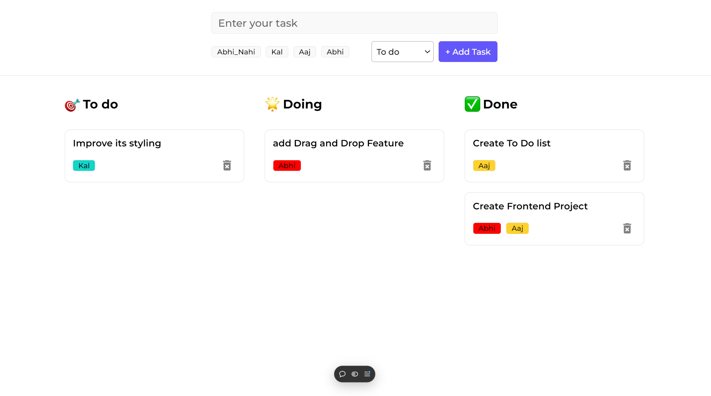

# Drag-and-Drop To-Do List

A modern, interactive To-Do List app built with **React** and **Vite**. This app features drag-and-drop functionality and unique task tags in Hindi like **Abhi_Nahi**, **Kal**, **Aaj**, and **Abhi**, allowing users to manage tasks intuitively across different stages.

## Features

- **Hindi Time Tags**: Assign tasks with meaningful tags:
  - **Abhi_Nahi**: Not now.
  - **Kal**: Tomorrow.
  - **Aaj**: Today.
  - **Abhi**: Right now.
- **Add, Delete, and Manage Tasks**: Quickly add, delete, and move tasks as needed.
- **Drag-and-Drop Functionality**: Rearrange tasks between sections seamlessly.
- **Task Status Boards**:
  - **To Do**: Initial tasks.
  - **Doing**: Tasks in progress.
  - **Done**: Completed tasks.
- **Responsive Design**: Works well on both desktop and mobile devices.
- **Fast Development**: Built with **Vite** for a lightning-fast development experience.

## Demo

Check out the live demo of the project [here](https://drag-and-drop-to-do-list-sanskargupta0s-projects.vercel.app/).



## Installation and Setup

1. Clone the repository:
    ```bash
    git clone https://github.com/Sanskargupta0/Drag-and-Drop-To-Do-List.git
    ```

2. Navigate to the project folder:
    ```bash
    cd Drag-and-Drop-To-Do-List
    ```

3. Install dependencies:
    ```bash
    npm install
    ```

4. Start the development server:
    ```bash
    npm run dev
    ```

5. Open your browser and go to `http://localhost:5173` to view the app.

## Usage

1. **Enter Your Task**: Type a task and select a Hindi tag (e.g., *Abhi*, *Kal*, etc.).
2. **Add a Task**: Click the "+ Add Task" button to add the task to the **To Do** section.
3. **Drag and Drop**: Drag tasks to move them between the **To Do**, **Doing**, and **Done** sections.
4. **Delete a Task**: Remove tasks by clicking a delete button or dragging them to a delete zone.

